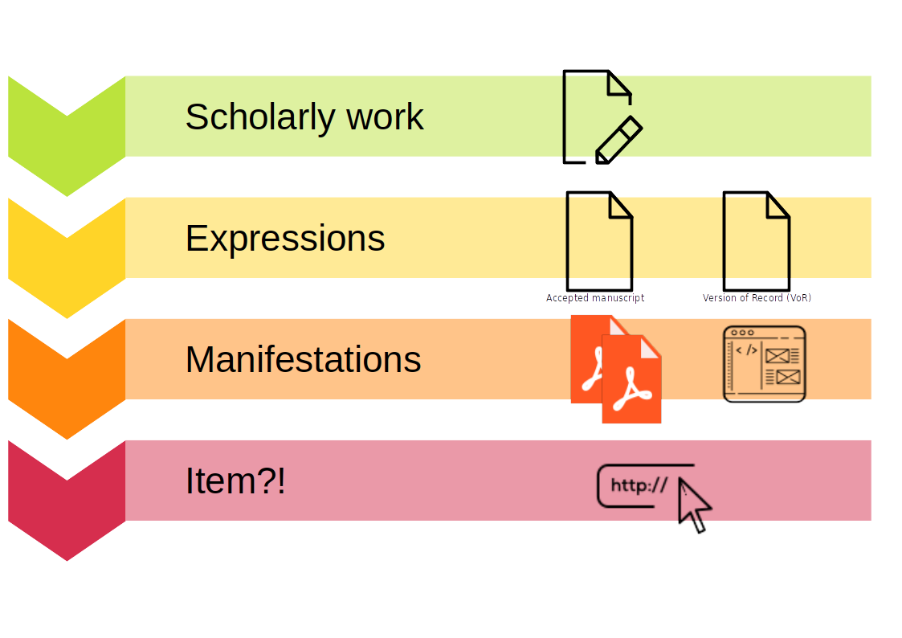
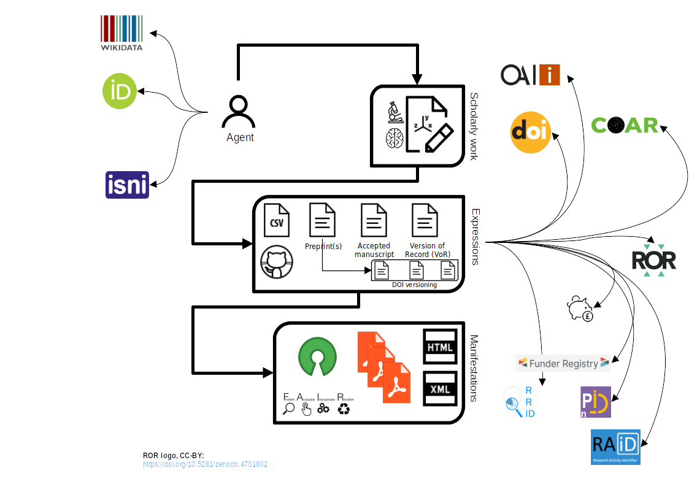

<!-- _class: title -->

# Modelling research output expressions : metadata schema modelling of publication lifecycles & scholarly entities


Dr George Macgregor
University of Glasgow
2023-09-06
https://purl.org/g3om4c


---

# A normal slide

# H1 again
## H2
### H3
- bullet
> quote
```
code
```
text

---

# Repository metadata context

- Repositories remain *very* good at making (scholarly) content discoverable
- [OAI-PMH](http://www.openarchives.org/OAI/openarchivesprotocol.html) still a principal machine interface to repository content, despite alternatives (e.g. [ResourceSync](http://www.openarchives.org/rs/toc))
- History - my favourite subject - and the folly of 'simple' Dublin Core...
- Metadata profiles central to improved interoperability and semantics
- Harvesting, aggregation, discovery and... compliance
---
# Profile examples...
Prominent repository metadata applications profiles include:
- OpenAIRE (literature repositories)
- OpenAIRE (data archives)
- OpenAIRE (software)
- UKETD 2017 (EThOS)
- Scholarly Works Applications Profile (SWAP) - deceased, but more on that later!
- Rioxx v2.0, more on this too!
 
---
# In 2013


The good old days... :smile:

...when publication lifecycles and scholarly entities were (*relatively*) simple...

---


---

# SWAP circa 2008

**SWAP: Scholarly Works Application Profile** [REF]
- Clear motivation; supported by Jisc
- Recognized importance of relations between entities, esp. funding
- Used FRBR properly! Yay!

**But never adopted by repositories**
- Overkill in 2008...?
- Difficult to implement within repository software
- Too esoteric for those working with scholarly digital content
- Useful conceptual exercise but did not address machine discovery satisfactorily

---
# 2023

The future envisaged by SWAP is now the present, sort of...

...but this future is actually more *complex*...

---




---
# Reality inescapable...

Enshrined in open research requirements of funders (Plan S, UKRI, G7)
Burgeoning 'PID graph'
Need to respond to complexity while ensuring discovery advantages


---
# Rioxx v 3.0
Research Output Metadata Schema
Version 2.0 widely adopted since 2016
Discovery improvements, esp. in harvesting and aggregation -- file locations critical (REF Petr's & Martin's work)
Version 3.0
Improves modelling of scholarly entities & relations
Capitalizes on discovery potential
Makes productive contribution to PID graph
PID-ification -- greater URI referencing

---
# Vocabularies
List vocabulraries
Optimum use of PIDs
Contributions to the PID graph
(Can create issues with 'authority of assertion' - see tomorrow!)

---
# Examples

(Produced linked examples in slides)


---
# but

Outdated thinking on these matters persists

Lack of technical understanding of URIs, PIDs, and relational linking


---
# Rioxx v 3.0

Long road -- changes to implement


---
# Title page ad hoc fix

If the title of your presentation is too long and the border intersects with the text underneath, use the following

```html
# Title
<br/>
<!-- empty line here --->
Author's name
University of XYZ
...
```
make sure to leave an empty line below the `<br/>` tag

---
<!-- _class: tinytext -->
# Tinytext class

- use `<!-- _class: tinytext -->` to make some text tiny
- might be useful for References
