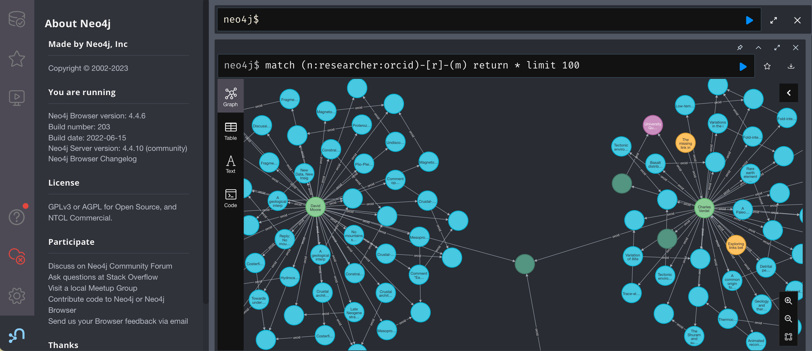
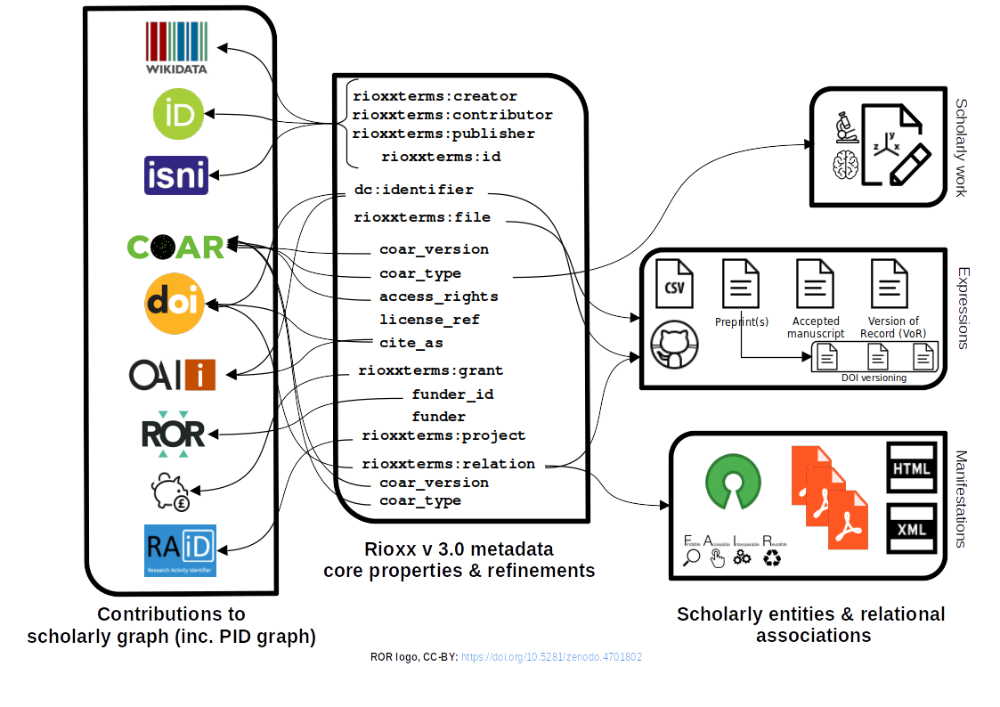

<!-- _class: title -->

# Modelling research output expressions : metadata schema modelling of publication lifecycles & scholarly entities


George Macgregor
University of Glasgow
2023-09-06
https://purl.org/g3om4c
https://orcid.org/0000-0002-8482-3973


---
# Overview

1. Briefly explore the metadata application profile landscape of open scholarly repositories
2. Prior attempts to model expressions, relations, etc. of scholarly works
3. Growth of the persistent identifier graph (PID graph)
4. How the Rioxx: Research Output Metadata Schema (v3.0) is responding to a PID-centric and relational reality
	- Brief exploration of Rioxx itself
5. Community reflection that the Rioxx experience, and reality, is prompting


---

# Repository metadata context

- OOTB, repositories remain *very* good at making (scholarly) content discoverable
- [OAI-PMH](http://www.openarchives.org/OAI/openarchivesprotocol.html) still a principal machine interface to repository content, despite alternatives (e.g. [ResourceSync](http://www.openarchives.org/rs/toc))
- History - my favourite subject - and the folly of 'simple' Dublin Core...
- Metadata profiles central to improved interoperability and semantics
- Harvesting, aggregation, discovery and... compliance
---
# Profile examples...
Prominent repository metadata applications profiles include:
- [OpenAIRE (literature repositories)](https://guidelines.openaire.eu/en/latest/literature/index.html)
- [OpenAIRE (data archives)](https://guidelines.openaire.eu/en/latest/data/index.html)
- [OpenAIRE (software)](https://software-guidelines.readthedocs.io/en/latest/)
- [UKETD 2017 (EThOS)](https://github.com/eprintsug/oai_uketd_dc)
- [Scholarly Works Applications Profile (SWAP) ](http://www.ukoln.ac.uk/repositories/digirep/index/Scholarly_Works_Application_Profile) - dead but not forgotten!
- [Rioxx v2.0](https://www.rioxx.net/profiles/v2-0-final/), more on this too!
 
---
# In 2013


The good old days... :smile:

...when publication lifecycles and scholarly entities were (*relatively*) simple...

---


---

# SWAP circa 2008

**SWAP: Scholarly Works Application Profile** [1]
- Clear motivation; supported by Jisc
- Recognized importance of relations between entities, esp. funding
- Used FRBR! Yay!

**But never adopted by repositories**
- Ahead of its time in 2008...?
- Difficult to implement within repository software
- Too esoteric for those working with scholarly digital content [2]
- Useful conceptual exercise but did not address machine discovery satisfactorily

---
# 2023

The future envisaged by SWAP is now the present, sort of...

...but this future is actually more *complex*...

---


---
# Trends in scholarly publication inescapable...

1. Need to respond to complexity while ensuring discovery advantages
	1. *Provenance & contextualization*
2. Enshrined in open research requirements of funders (Plan S, UKRI, G7)
3. *Reproducibility, verification, replication* -- scholarly record & the "reproducibility crisis"
	1. Growth of rights retention strategy (RRS), FAIR data, data management planning (DMPs)
4. Supporting the burgeoning 'PID graph'
---

[TIB – Leibniz Information Centre for Science and Technology - PID Service](https://projects.tib.eu/pid-service/en/persistent-identifiers/persistent-identifiers-pids/) (CC-BY)


---

Exploring the graph with [Neo4j](https://neo4j.com/)...

---
# Rioxx
**Rioxx: Research Output Metadata Schema**
- [Version 2.0](https://www.rioxx.net/profiles/v2-0-final/) widely adopted since 2016; Dublin Core with extensions
- Discovery improvements, esp. in harvesting and aggregation [2] -- file location links critical [3]
	- Repositories default support of Dublin Core spectacularly ineffective for OAI-PMH harvesting of digital content
	- *Full-text harvesting request average for single resource using Dublin Core:* 
	- **Digital Commons** (13K!!), **DSpace** (1.5K!) [3]
	- **EPrints** = 8. Better but 7 too many! [3]
---
# Rioxx v3.0
**Version 3.0**
- Improves modelling of scholarly entities & relations
	- Borrows conceptual thinking from FRBR (but not SWAP!)
- Capitalizes on discovery potential
- Better supports productive contribution to PID graph
- 'PID-ification '-- greater URI referencing & semantics
- Retains some semblance of 'traditional' notions of publication `:thinking:`

---
# v3.0: Vocabularies, semantics, & PID types
(Beyond structure) language independent semantics conveyed by SKOS:
- [COAR Resource Type Vocabulary](http://purl.org/coar/resource_type/)
- [COAR Access Rights Vocabulary](http://purl.org/coar/access_right/)
- [COAR Version Type Vocabulary](http://purl.org/coar/version/)

Resource Type Label: **'observational data (English)'**, **'gözlemsel veri (Türkçe)'**, etc.
```http://purl.org/coar/resource_type/FF4C-28RK```
Broader concept:  **'dataset'**
```http://purl.org/coar/resource_type/c_ddb1```

---
# ...
Referral to entities by URIs widely supported but anticipated PID types include:

- **Creators/Contributors**: *ORCID,* ISNI, VIAF, WikiData
- **Organizations**: ISNI, VIAF, WikiData - *ROR*, *FundRef*
- **Research activity**: *RAiD*

Optimum use of PIDs for reference and relational associations between related works and expressions to enrich PID graph and support discovery / contextualization
-  (Can create issues with 'authority of assertion' - see tomorrow!)

---
# Example snippets...

```xml
<rioxxterms:contributor>
    <rioxxterms:name>Bhopal, Kalwant</rioxxterms:name>
	<rioxxterms:id>https://orcid.org/0000-0003-3017-6595</rioxxterms:id>
	<rioxxterms:id>https://isni.org/isni/0000000038079210</rioxxterms:id>
	<rioxxterms:id>https://www.wikidata.org/wiki/Q61998297</rioxxterms:id>
</rioxxterms:contributor>
```
---
# ...
```xml
<rioxxterms:file 
	coar_type="https://purl.org/coar/resource_type/c_6501" 
	coar_version="https://purl.org/coar/version/c_ab4af688f83e57aa"
	deposit_date="2023-03-28" 
	resource_exposed_date="2023-03-28" 
	cite_as="https://doi.org/10.17868/strath.00084907"
	access_rights="https://purl.org/coar/access_right/c_abf2"
	license_ref="https://creativecommons.org/licenses/by/4.0/"
	format="application/pdf">
            https://strathprints.strath.ac.uk/84907/7/Jiang_etal_...on.pdf
</rioxxterms:file>
```
---
# ...
Introduction of ```rioxxterms:relation```:
```xml
<!--Relation to VoR-->
<rioxxterms:relation coar_type="https://purl.org/coar/resource_type/c_6501" 
    coar_version="https://purl.org/coar/version/c_970fb48d4fbd8a85">
            https://doi.org/10.1109/TGRS.2023.3262412
</rioxxterms:relation>

<!--...to research dataset(s) - simulation data-->
<rioxxterms:relation coar_type="http://purl.org/coar/resource_type/W2XT-701">
            https://doi.org/10.15778/RESIF.MT
</rioxxterms:relation>

<!--...to research data(s) - observational data-->
<rioxxterms:relation coar_type="http://purl.org/coar/resource_type/FF4C-28RK">
            https://doi.org/10.5880/fidgeo.2021.032
</rioxxterms:relation>
```

---
# Some fuller but simple examples...
[Example 1](https://github.com/geo-mac/Rioxx-development/blob/development/model/rioxx-schema-examples-july.md#example-1), [example 2](https://github.com/geo-mac/Rioxx-development/blob/development/model/rioxx-schema-examples-july.md#example-2), [example 3](https://github.com/geo-mac/Rioxx-development/blob/development/model/rioxx-schema-examples-july.md#example-3)

---



---
# But, questions for the community?

Are 'traditional' notions of publication holding back the community when it comes to resource description in a more URI-centric and relationally dependent resource environment?

*Possibly...*

---
# Attachment to outdated notions of publication? :thinking:

Attachment to seeing things through the prism of the 'published version' (Version of Record - VoR)
- Distorts purer / richer metadata modelling of publication lifecyles and scholarly entities
	- Including Rioxx v 3.0
- Prism reinforces the primacy of publishers and dysfunction in scholarly publishing
- Reality is increasingly fluid and relational
---
# Lack of technical understanding of URIs, PIDs, and relational linking? :thinking:

The revenge of Linked Data and the Semantic Web...?
- Improved understanding of web technology necessary
- URIs, PIDs, relational linking and the role of distributed metadata
- Working for the benefit of machines as well as humans

---
# Rioxx v 3.0

- Version 3.0, 2nd release candidate available
- Long road -- changes always to implement!
- Advocate for adoption  - technical but also socio-technical
- JSON-LD serialization of Rioxx forthcoming
---
## Thanks for listening!
### Questions?!


*Acknowledgement of work by Rioxx Governance Group:
Nicola Dowson, Mick Eadie, Petr Knoth, Bev Jones, George Macgregor & Paul Walk*

---
# References

[1] J. Allinson, [‘Describing Scholarly Works with Dublin Core: A Functional Approach’](https://eprints.whiterose.ac.uk/8522/), *Library Trends*, 57 (2), pp. 221–243, 2008. Accessed Jul. 18, 2023. 

[2] E. O’Neill and M. Žumer, ‘FRBR: Application of the Model to Textual Documents’,
Libr. Resources Tech. Serv., 62 (4), Art. no. 4, Oct. 2018. Available: https:
//doi.org/10.5860/lrts.62n4.176

[2] P. Knoth and B. Notay, ['UKRI OA policy requirements for repositories and how to meet them'](https://www.slideshare.net/petrknoth/ukri-oa-policy-requirements-for-repositories-and-how-to-meet-them), presented at the *Jisc Workshop, 2021*. Accessed: Jul. 18, 2023.  

[3] P. Knoth, M. Cancellieri, M. Klein, ['Comparing the performance of OAI-PMH with ResourceSync'](https://www.slideshare.net/martinklein0815/comparing-the-performance-of-oaipmh-with-resourcesync), *The 14th International Conference on Open Repositories (OR2019)* June 2019. Universität Hamburg, Hamburg. Accessed: Jul. 18, 2023.


---
# Questions

Thanks for listening!