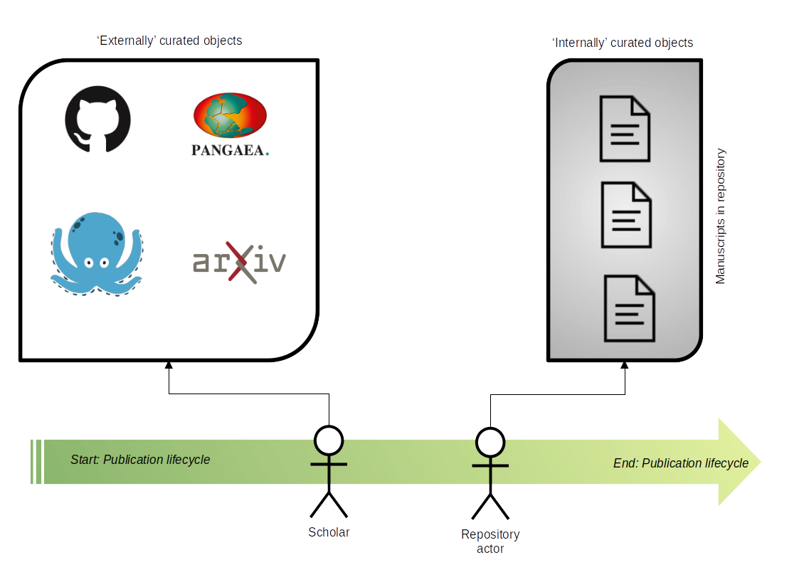
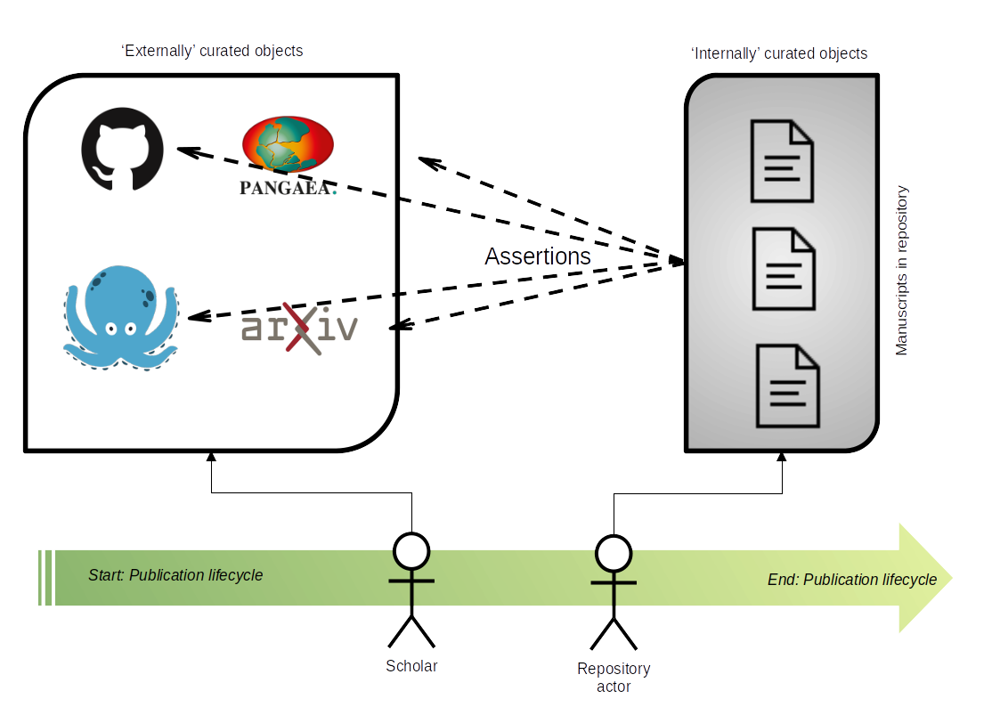
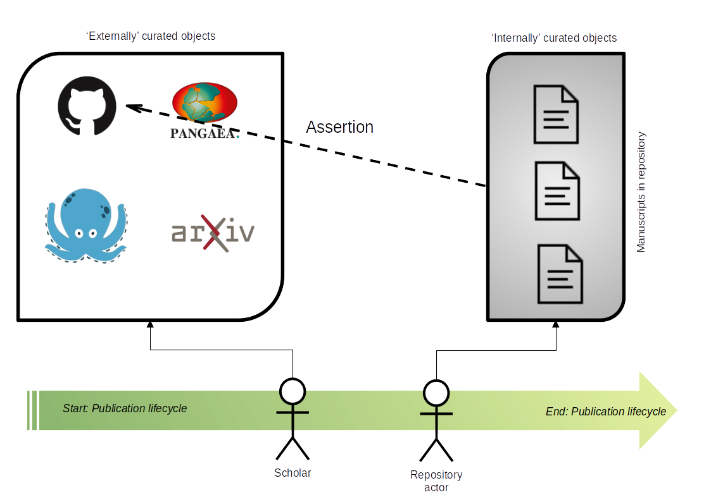
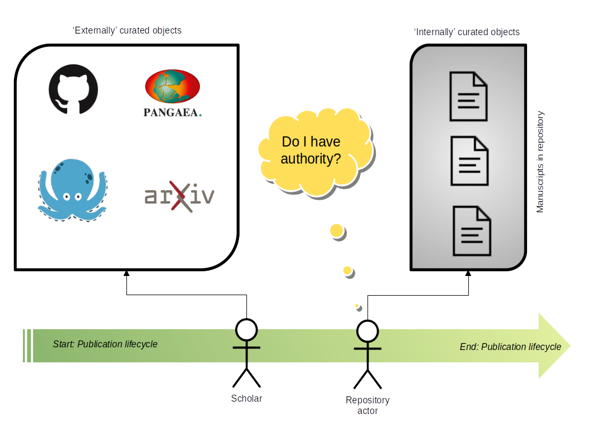
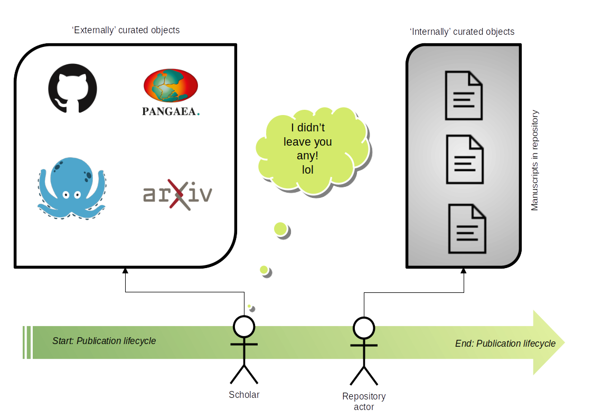
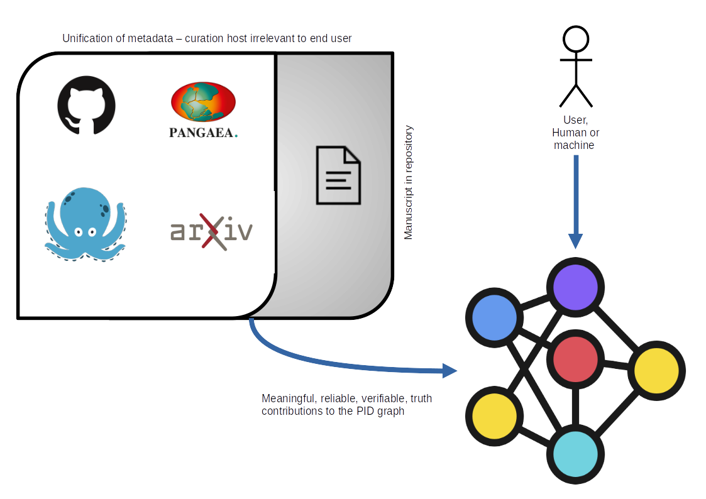
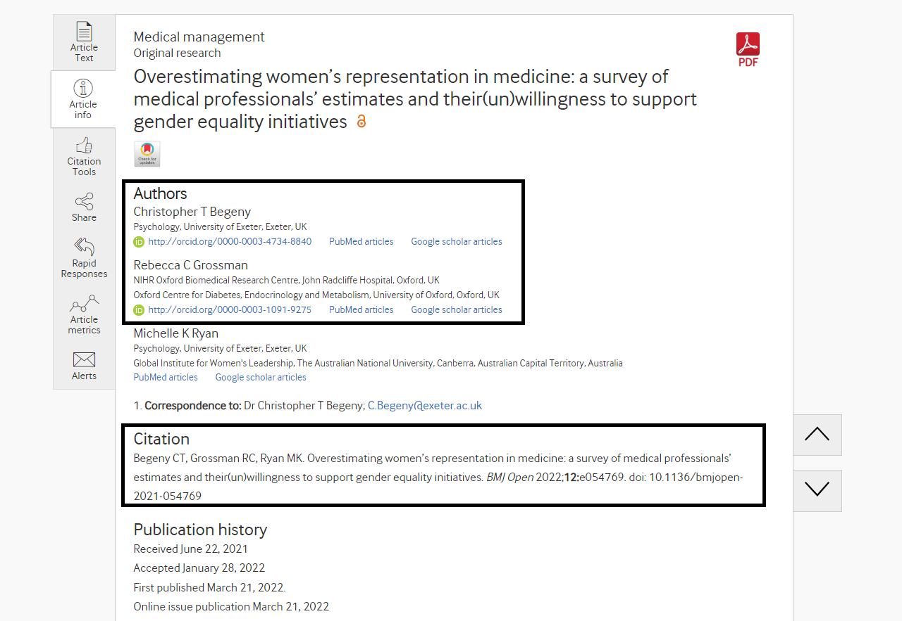
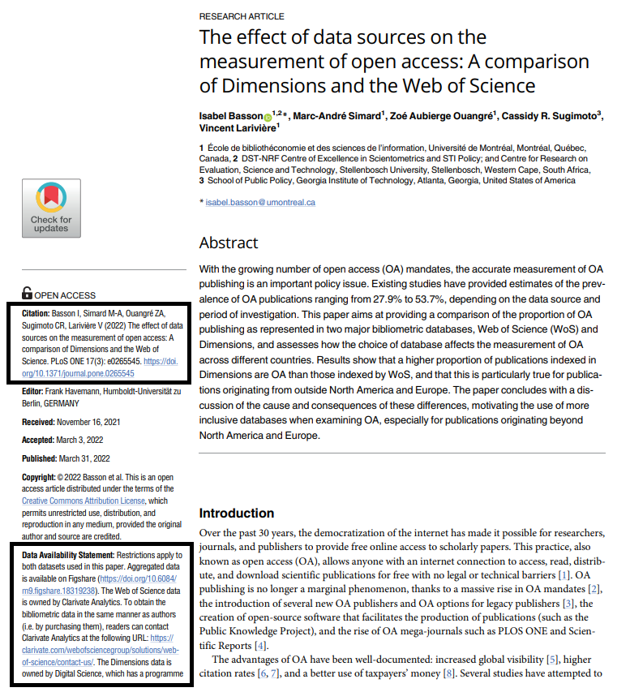
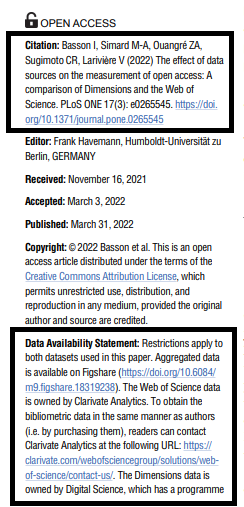

# Authority of assertion in repository contributions to the PID graph

[George Macgregor](https://purl.org/g3om4c)
University of Glasgow
2023-09-07
https://purl.org/g3om4c
https://orcid.org/0000-0002-8482-3973

(w/ [Barbara S. Lancho-Barrantes](https://orcid.org/0000-0001-9994-8886) & [Diane Rasmussen McAdie](https://orcid.org/0000-0003-1275-7054))

Slides available: `https://doi.org/10.17868/strath.00085167`

---

# Overview
This paper: to outline an emerging challenge in repository metadata and users' discovery of repository content 

Exploring issues when levels of 'authority of assertion' are lacking or are uncertain

- Emergence of increasingly fluid, distributed, and fragmented scholarly objects
- Emergence of persistent identification as a (partial) solution
- The growing scholarly graph, e.g. 'PID graph'
- Implications for repositories and the question of 'authority of assertion'
- Scholars' 'PID literacy' as an impediment to satisfactory scholarly objective description (and ergo discovery) [1]

---

---
# Metadata conventions...

- Generating statements of fact about (often) tangible things...
- Even in formal digital libraries, objects (often) static things with predictable descriptive metadata attributes (e.g. digitized objects, etc)
	- Linked Open Data (RDF/URIs)
- "...change is slow" [2]

\\\

[Photo, previous slide :arrow_heading_up:] [Dresden-Neustadt. Sächsische Landesbibliothek - Staats- und Universitätsbibliothek Dresden, Europeana](https://www.europeana.eu/en/item/437/item_GWKOGR5EYEUJ4CCOGJF5ROU3N5PQJFWE) (CC-BY-SA) 

---
# Open scholarly infrastructure

[3]

---
# Distribution, fragmentation, fluidity
Disorientation grows for metadata creators with research domain, but also for users in discovery for research content...
- Increasing levels of distribution, fragmentation, and fluidity
	- Emergence of open, distributed, multi object (often 'non-standard') transient scholarly objects 
- Multi-object exists elsewhere (e.g. METS package) but all components under direct custodianship where *authority of assertion* exists 
- PIDs increasingly central to linking, description, disambiguation, discovery 

---
# What are PIDs?
## PID = *persistent identifier*  :smile:
- PIDs come in many flavours, e.g. DOI, ORCID, RAiD, ROR, etc. -- *and beyond!*
`https://doi.org/10.17868/strath.00085975`
`https://orcid.org/0000-0002-8482-3973`
`https://ror.org/05j0ve876`
- Enables long-term identification but also 'actionability' because they are (*generally*) formed as URIs
- PIDs usually underpinned by some form of registry which registers new PIDs and resolves them (and contains *metadata*!) (e.g. DataCite, CrossRef)

---
# Why have PIDs?
## PID = *persistent identification* :wink:
-  Provides unique and persistent reference to an *entity* normally accessible over the Internet
- Maintenance of the scholarly record - citability, verification, reproducibility, replicability [5], [6]
	- *'Reference rot' / 'link rot' - e.g [Klein, Van de Sompel et al.](https://scholar.google.com/citations?user=nMRDlR8AAAAJ&hl)* [6], [7]
- Uniquely identify entities on the web; enables discovery these entities -- happy times!
- *The quest to encode PIDs within metadata to link and grow the utility of data*

---
# PID graph
.... or Linked Open Data déjà vu... ? [4]

---

[TIB – Leibniz Information Centre for Science and Technology - PID Service](https://projects.tib.eu/pid-service/en/persistent-identifiers/persistent-identifiers-pids/) (CC-BY)

---

Exploring the graph with [Neo4j](https://neo4j.com/)...

---

RAiD envelope diagram. From Janke et al. [1], CC-BY.

---

---

---

# Repositories on front line of PID data contributions

`distribution + fragmentation + fluidity`

**Such metadata key to making scholarly works:**

*Interpretable...*
- to contextualize; to provide provenance

*Support reproducibility...*
- to facilitate reproduciblity, verification, replication 

*Discoverable...*
- to enable discovery through a variety of access points, some unconventional

---
# What is 'authority of assertion'?

Concept of 'authority of assertion' exists but an under-research area; no definitions

- *[authority](https://dictionary.cambridge.org/dictionary/english/authority)* = "official permission or the legal right to do something" [Cambridge Dictionary def]

- *[assertion](https://dictionary.cambridge.org/dictionary/english/assertion)* = "a statement that you strongly believe is true" [Cambridge Dictionary]

**Ergo, could we propose the following:**

*The extent to which there exists a right to make metadata statements about objects and their relations, such that these statements are reliable, verifiable, and true* 

---
# The 'bread crumbs' and authority of assertion

---

---

---

---

---

---

---

---
# Assertion and 'PID literacy'

- Components of multi-object, non-standard scholarly objects can often be inferred (by human & *maybe* machine)
- Lack of authority to assert can make *reliable, verifiable, and true* statements difficult or impossible
	- We want to assert the predicate / attribute of that PID, e.g. `IsVersionOf`, `HasPart`, etc.
	- Relational understanding is necessary

*Analogy - cataloguing a book and discovering that half the title page is missing...*

---
# ...
All of which leads to a lack of authority to assert:
- **Undermining** the multi-part scholarly object
- **Undermining** end-user discovery and establishment of provenance
- **Undermining** open research, esp. verification, reproducibility, etc.
- **Undermining** ability of repositories or other scholarly services to contribute meaningful data to the wider scholarly PID graph
---
# Er, what the heck is 'PID literacy'?!
What does a PID literate scholar look like?

"PID literate scholar might display the following competencies:

1. An understanding of persistent identification in scholarship, when it should be used, and its importance to the scholarly record and the wider PID graph.    
2. An ability to accurately identify, reproduce, and cite PIDs in scholarship activities.    
3. Cognizance of adjacent PID types relevant to scholars’ community of practice, such as those devised to identify scholarly 'things' other than academic papers." [1]
---
# Where art thou, PID literacy?
- Challenges within the open research culture space generally
- Open data, data management planning (DMP), etc.
- [Our research reveals](https://doi.org/10.1515/opis-2022-0142) [1] many scholars (~35%) demonstrate limited recognition of even common PIDs, e.g. DOIs & ORCIDs
- Even less understanding of how they should be (re)used - widespread confusion
- Concerning levels of failure recorded by participant scholars with our research instrument
---

---

---

But:

- Enthusiasm for PIDs in scholarship; perceived positively

Radical improvement of 'digital scholarship' skills necessary
Skills deficit notable across all disciplines, though better in some
Advocating the importance of 
---
# Centrality of scholars to making a better scholarly web
HELP NOW PLEASE! :anguished:
- To go beyond the academic paper we will increasingly need help from literate scholars
- An understanding that their works are increasingly diffuse
Going beyond requires adequate signposting of related or adjacent scholarly entities

'To do' for open research / scholarly communications teams: advocate; communicate; train.

Better metadata modelling of the new nature of scholarly research objects reflected in [Rioxx v 3.0](https://www.rioxx.net/profiles/v3-0-draft-2/) and [DataCite Schema](https://schema.datacite.org/)

---

---

---

---
# References

[1] G. Macgregor, B. S. Lancho-Barrantes, and D. R. Pennington, 'Measuring the concept of PID literacy: user perceptions and understanding of PIDs in support of open scholarly
infrastructure', *Open Information Science*, vol. 7, no. 1, 2023, available: `https://doi.org/10.1515/opis-2022-0142`

[2] G. Alemu. (2022). 'Resource Description and Access (RDA)'. In *The Future of Enriched, Linked, Open and Filtered Metadata: Making Sense of IFLA LRM, RDA, Linked Data and BIBFRAME* (pp. 197-212). Facet, London, available `https://doi.org/10.29085/9781783304943.010`

[3] G. Bilder, J. Lin, and C. Neylon, 'The Principles of Open Scholarly Infrastructure', 2020, available: `https://doi.org/10.24343/C34W2H` 

[4] H. Cousijn et al., 'Connected Research: The Potential of the PID Graph', *Patterns*, vol. 2, no. 1, p. 100180, 2021, available: `https://doi.org/10.1016/j.patter.2020.100180`

[5] H. M. Sandy et al., 'Making a case for open research: implications for reproducibility and transparency', *Proceedings of the Association of Information Science & Technology*, vol. 54, no. 1, pp. 583–586, 2017, available: `https://doi.org/10.1002/pra2.2017.14505401079`

[6] S. M. Jones et al., 'Scholarly Context Adrift: Three out of Four URI References Lead to Changed Content', *PLoS ONE* vol. 11, no. 1, p. e0167475, 2021, available: `https://doi.org/10.1371/journal.pone.0167475`

[7] S. M. Jones, M. Klein, and H. Van de Sompel, 'Robustifying Links To Combat Reference Rot', *Code4Lib Journal*, no. 50, 2021, available: `https://journal.code4lib.org/articles/15509` 
