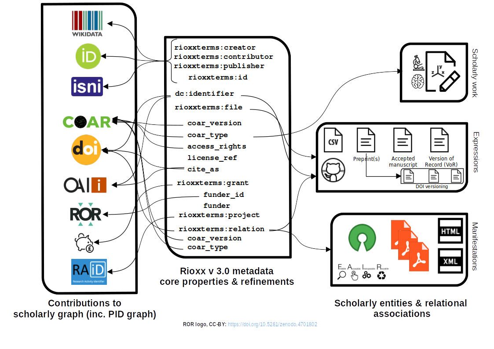

# Authority of assertion in repository contributions to the PID graph

[George Macgregor](https://purl.org/g3om4c)
University of Glasgow
2023-09-07
https://purl.org/g3om4c
https://orcid.org/0000-0002-8482-3973

(w/ [Barbara S. Lancho-Barrantes](https://orcid.org/0000-0001-9994-8886) & [Diane Rasmussen McAdie](https://orcid.org/0000-0003-1275-7054))

---

# Overview

This paper is to outline a growing problems which is currently inadequately acknowledged in the literature or in the community.

---

# Open scholarly infrastructure

---
# Traditional cataloguing / metadata creation

Statements of fact
Item in front of the metadata guru

Even in formal digital libraries, objects static (e.g. digitized objects, etc)

---
# The distributed, fragmented, fluid

Multi object scholarly outputs

Unlike a METS package

---
# What are PIDs?
## PID = *persistent identifier*  :smile:
- PIDs come in many flavours, e.g. DOI, ORCID, RAiD, ROR, etc. -- *and beyond!*
`https://doi.org/10.17868/strath.00085975`
`https://orcid.org/0000-0002-8482-3973`
`https://ror.org/05j0ve876`
- Enables long-term identification but also 'actionability' because they are (*generally*) formed as URIs
- PIDs usually underpinned by some form of registry which registers new PIDs and resolves them (and contains *metadata*!) (e.g. DataCite, CrossRef)

---
# Why have PIDs?
## PID = *persistent identification* :wink:
-  Provides unique and persistent reference to an *entity* normally accessible over the Internet
- Maintenance of the scholarly record - citability, verification, reproducibility, replicability
- 'Reference rot' / 'link rot' - e.g [Klein, Van de Sompel et al.](https://scholar.google.com/citations?user=nMRDlR8AAAAJ&hl) [REF]
- Uniquely identify entities on the web; enables discovery these entities -- happy times!
- *Encode PIDs within metadata to link and grow the utility of data*

---
# PID graph
Linked Open Data déjà vu... of sorts...

---

[TIB – Leibniz Information Centre for Science and Technology - PID Service](https://projects.tib.eu/pid-service/en/persistent-identifiers/persistent-identifiers-pids/) (CC-BY)

---

Exploring the graph with [Neo4j](https://neo4j.com/)...

---

RAiD envelope diagram. From Janke et al. [1], CC-BY.

---

---

# Repositories on front line of PID data contributions

---
To make scholarly work interpretable; to contextualize; to consolidate provenance

Reproduciblity, verification, replication 

Concept of the multi-object work -- paper only understood with all components, yet all components are not under institutional control

Comparison with METS package -- all component under institutional control and authority of assertion exists.

---
# What is authority of assertion?

Definitions of 'authority of assertion' - none available

---

# Does PID literacy hold the key?

---