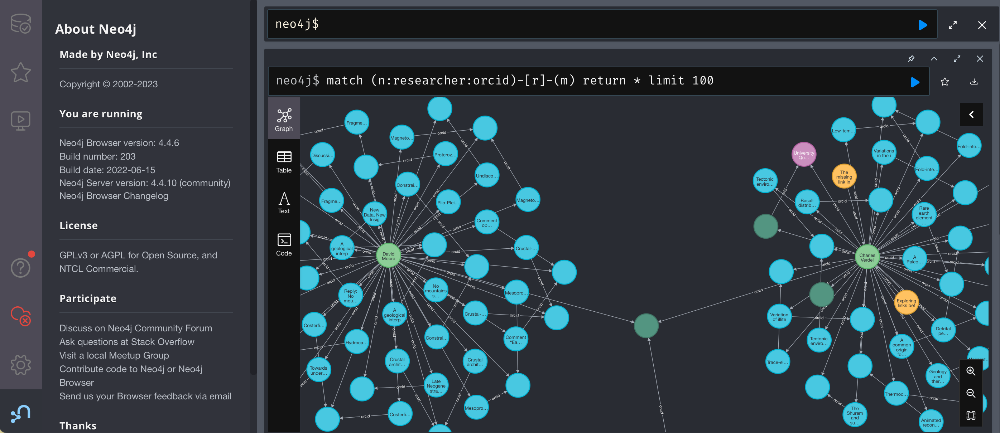

# Authority of assertion in repository contributions to the PID graph

[George Macgregor](https://purl.org/g3om4c)
University of Glasgow
2023-09-06
https://purl.org/g3om4c
https://orcid.org/0000-0002-8482-3973

(w/ [Barbara S. Lancho-Barrantes](https://orcid.org/0000-0001-9994-8886) & [Diane Rasmussen McAdie](https://orcid.org/0000-0003-1275-7054))

---

# Overview

---

# Open scholarly infrastructure

---
# The distributed, fragmented, fluid
 
---
# Persistent identifiers

Example PIDs

---
# PID graph

---

[TIB – Leibniz Information Centre for Science and Technology - PID Service](https://projects.tib.eu/pid-service/en/persistent-identifiers/persistent-identifiers-pids/) (CC-BY)

---

Exploring the graph with [Neo4j](https://neo4j.com/)...

---

RAiD envelope diagram. From Janke et al. [1], CC-BY.

---

---

# Repositories on front line of PID data contributions

---
To make scholarly work interpretable; to contextualize; to consolidate provenance

Reproduciblity, verification, replication 

Concept of the multi-object work -- paper only understood with all components, yet all components are not under institutional control

Comparison with METS package -- all component under institutional control and authority of assertion exists.

Definitions of 'authority of assertion' - none available

---