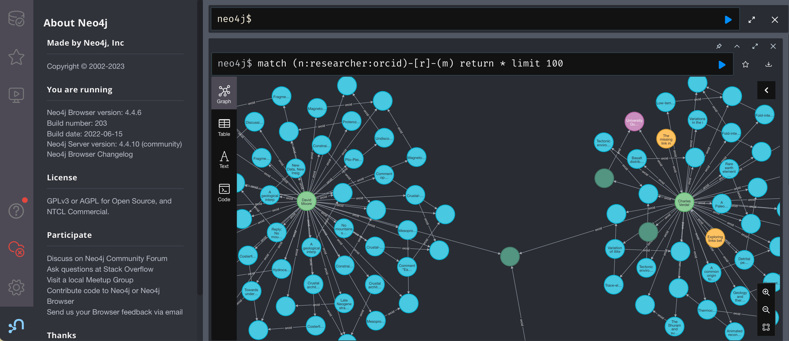
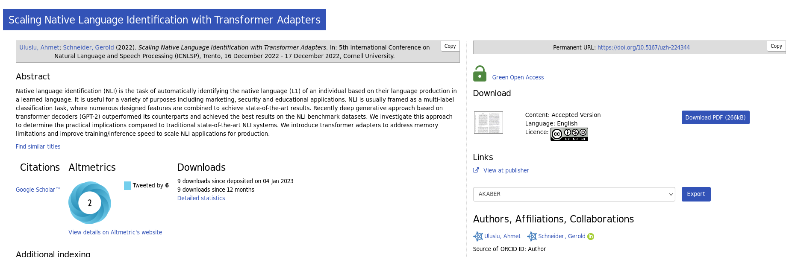
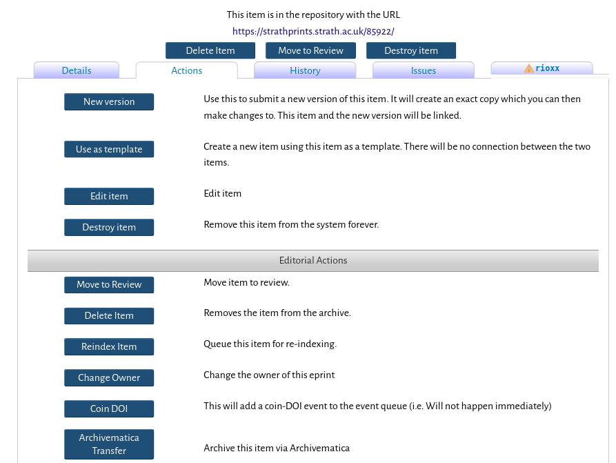

<!-- _class: title -->

# PIDs and repositories: experiences & practical issues of implementing DOIs for content
## Perspectives from Cambridge (Apollo) & Strathclyde (Strathprints)


Agustina Martinez-Garcia (University of Cambridge)
Alexia Sutton (University of Cambridge)
George Macgregor (University of Strathclyde)


---
# Session overview

1. Brief explanation of persistent identifiers (PIDs)
- *Some technical things; some soft things*
- *Some adjacent concepts...*

2. Perspectives from Strathclyde - [Strathprints](https://strathprints.strath.ac.uk)
3. Perspectives fro Cambridge - [Apollo](https://www.repository.cam.ac.uk/)
- *Different systems and different journeys, but useful overlap between Cambridge & Strathclyde!* :-)
4. Questions / discussion

---
# PIDs and repositories: experiences & practical issues of implementing DOIs for content
## Perspectives from Strathclyde (Strathprints)


George Macgregor
University of Strathclyde
2023-06-30
https://purl.org/g3om4c

---
# The 'technical' bit: what are PIDs?
## PID = *persistent identifier* (Doh!) :smile:
- PIDs come in many flavours, e.g. DOI, ORCID, RAiD, ROR, etc. -- *and beyond!*
- Enables long-term identification but also 'actionability' because they are formed as URIs
- PIDs usually underpinned by some form of registry which registers new PIDs and resolves them (and contains metadata!) (e.g. DataCite, CrossRef)

---
# Why have PIDs?
## PID = *persistent identification* (Doh!) :wink:
-  Provides unique and persistent reference to an entity normally accessible over the Internet
- Maintenance of the scholarly record - citability, verification, reproducibility, replicability
- 'Reference rot' / 'link rot' - e.g [Klein, Van de Sompel et al.](https://scholar.google.com/citations?user=nMRDlR8AAAAJ&hl)
- Unique identify entities on the web; discovery these entities -- happy times
- *Encode PIDs within metadata to link and grow the utility of data*

---
# The 'PID graph'...


[TIB – Leibniz Information Centre for Science and Technology - PID Service](https://projects.tib.eu/pid-service/en/persistent-identifiers/persistent-identifiers-pids/) (CC-BY)


---
# ...


[Research Graph Foundation (Australia), National (PID) Graph](https://researchgraph.org/national-graph/) (CC-BY)


---
# The 'soft' bit: things to remember about PIDs
- Technical issues exist *but* persistent identifiers really a 'soft' issue because...

PIDs only persistent:
- while the PID registration service *commits* to resolving them, and;
- while the organization / publisher *commits* to updating the registration service (registry)

---
# Commitments, commitments, commitments ...
---

# Strathprints DOI journey...
## Using Strathprints as the case study (based on EPrints) 
Strathprints connected to Current Research Information System (CRIS) - Pure
- [Repository and CRIS interoperability issues...](https://strathprints.strath.ac.uk/68240/)
But much of what will be stated applies beyond EPrints and Pure....

---
# What do you need to begin minting?

- [DataCite](https://datacite.org/) membership (subscription)
- Single subscription but can be used for different DOI prefixes and/or different services
- e.g. [Strathprints](https://strathprints.strath.ac.uk) (research publications & other animals - grey lit, overlay journals), [STAX](https://stax.strath.ac.uk/) (theses), [KnowledgeBase ](https://pureportal.strath.ac.uk/en/datasets/)(research data), etc.
- Piggyback off research data account...?
---
# Strathprints DOI journey...
DataCite member since circa 2015
Membership used for:
- 2015: Research data (KnowledgeBase)
- **2017: Open grey scholarly literature (Strathprints) - manual DOI minting**
- **2018: Research publications (Strathprints) - semi-automated DOI minting**
- **2021: Research publications (Strathprints) - fully automated DOI minting**
- 2022: Research theses (STAX) - fully automated DOI minting
---
# Example
**'Eigenvalue decomposition of a parahermitian matrix : extraction of analytic Eigenvectors'**

- Example: [https://doi.org/10.17868/strath.00085235](https://doi.org/10.17868/strath.00085235)
- And to the [big registry](https://commons.datacite.org/doi.org/10.17868/strath.00085235) in the sky....
---
DataCiteDoi integration with EPrints


https://github.com/eprintsug/DataCiteDoi

https://bazaar.eprints.org/1100/

---
# Example... walk the walk :smile:
**'PIDs and repositories: experiences & practical issues of implementing DOIs for content : perspectives from Strathclyde (Strathprints)'**

Deposited here: 

Let's mint now!

---
# Things to ponder...

Auto minting?
- [ZORA](https://www.zora.uzh.ch/) - Zurich Open Repository Archive (University of Zurich)
- Example: https://doi.org/10.5167/uzh-224344

---
# ...pondering continued
or rules-based minting?
- EPrints DataCite integration enables automatic but conditional DOI minting
- i.e. specific content types
---
# ...pondering extended
or discretionary minting?
- Manually initiated by repository team
- e.g. for RRS/UKRI compliance, overlay journal publication, grey literature, etc.
---

---
# When to mint a DOI?

Version 
Agustina and Alexia to say more, inc. DOI versioning.

---
---
# Minting, but not as we know it, Jim...

Important -- there is always an option available to comply, even with DOIs.

DataCite form
Export and import DataCite compliant XML metadata
- 
---
# Other PIDs...
CORE OAI IDs
 
---

# Other compliance options...
Zenodo

 
---

# Possible pain points...
Project data
Integrations with CRIS
'Write protecting' database fields
Other PIDs and enriching the PID graph
Ensuring relational links


 
---
# Title page ad hoc fix

If the title of your presentation is too long and the border intersects with the text underneath, use the following

```html
# Title
<br/>
<!-- empty line here --->
Author's name
University of XYZ
...
```
make sure to leave an empty line below the `<br/>` tag

---
<!-- _class: tinytext -->
# Tinytext class

- use `<!-- _class: tinytext -->` to make some text tiny
- might be useful for References
