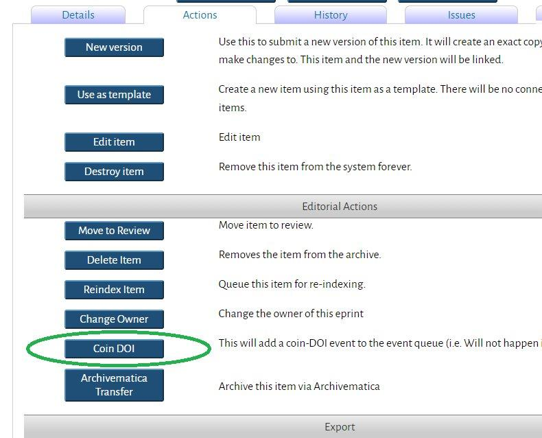
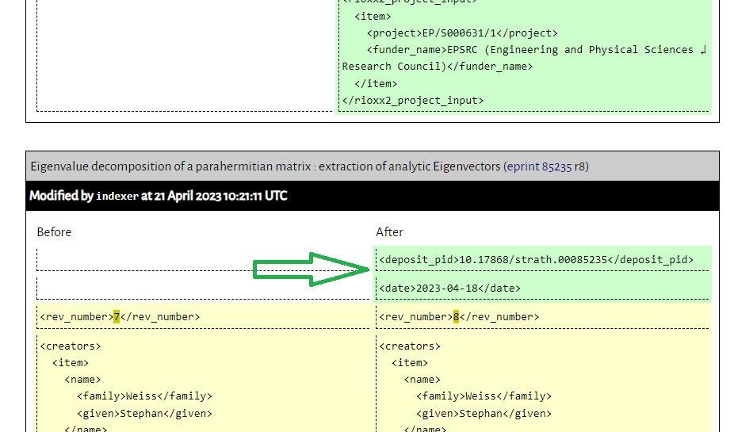

# PIDs and repositories: experiences & practical issues of implementing DOIs for content
## Perspectives from Cambridge (Apollo) & Strathclyde (Strathprints)

Agustina Martinez-Garcia (University of Cambridge)
Alexia Sutton (University of Cambridge)
George Macgregor (University of Strathclyde)

---
# Session overview

1. Brief explanation of persistent identifiers (PIDs)
- *Some technical things; some soft things*
- *Some adjacent concepts...*

2. Perspectives from Strathclyde - [Strathprints](https://strathprints.strath.ac.uk) (EPrints & Pure)
3. Perspectives from Cambridge - [Apollo](https://www.repository.cam.ac.uk/) (DSpace & Elements)
- *Different systems and different journeys, but useful overlap between Cambridge & Strathclyde!* :-)
4. Questions / discussion
---
# PIDs and repositories: experiences & practical issues of implementing DOIs for content
## Perspectives from Strathclyde (Strathprints)

George Macgregor
University of Strathclyde
https://purl.org/g3om4c

---
# The 'technical' bit: what are PIDs?
## PID = *persistent identifier*  :smile:
- PIDs come in many flavours, e.g. DOI, ORCID, RAiD, ROR, etc. -- *and beyond!*
- Enables long-term identification but also 'actionability' because they are (*generally*) formed as URIs
- PIDs usually underpinned by some form of registry which registers new PIDs and resolves them (and contains metadata!) (e.g. DataCite, CrossRef)

---
# Why have PIDs?
## PID = *persistent identification* :wink:
-  Provides unique and persistent reference to an *entity* normally accessible over the Internet
- Maintenance of the scholarly record - citability, verification, reproducibility, replicability
- 'Reference rot' / 'link rot' - e.g [Klein, Van de Sompel et al.](https://scholar.google.com/citations?user=nMRDlR8AAAAJ&hl)
- Uniquely identify entities on the web; enables discovery these entities -- happy times!
- *Encode PIDs within metadata to link and grow the utility of data*

---
# The 'PID graph'...

[TIB – Leibniz Information Centre for Science and Technology - PID Service](https://projects.tib.eu/pid-service/en/persistent-identifiers/persistent-identifiers-pids/) (CC-BY)

---
# ...

[Research Graph Foundation (Australia), National (PID) Graph](https://researchgraph.org/national-graph/) (CC-BY)

---
# The 'soft' bit: things to remember about PIDs
- Technical issues exist *but* persistent identifiers really a 'soft' issue because...

PIDs only persistent:
- while the PID registration service *commits* to resolving them, and;
- while the organization / publisher *commits* to updating the registration service (registry)

---
# Commitments, commitments, commitments ...
---

# Strathprints DOI journey...
## Using Strathprints as the case study (based on EPrints) 
Strathprints connected to Current Research Information System (CRIS) - Pure
- [Repository and CRIS interoperability issues...](https://strathprints.strath.ac.uk/68240/) to be overcome
But much of what will be stated applies beyond EPrints and Pure....

---
# What do you need to begin minting?

- [DataCite](https://datacite.org/) membership (subscription)
- Single subscription but can be used for different DOI prefixes and/or different services
- e.g. [Strathprints](https://strathprints.strath.ac.uk) (research publications & other animals - grey lit, overlay journals), [STAX](https://stax.strath.ac.uk/) (theses), [KnowledgeBase ](https://pureportal.strath.ac.uk/en/datasets/)(research data), etc.
- Piggyback off research data account...?
---
# Strathprints DOI journey...
DataCite member since circa 2015
Membership used for:
- 2015: Research data (KnowledgeBase)
- **2017: Open grey scholarly literature (Strathprints) - manual DOI minting**
- **2018: Research publications (Strathprints) - semi-automated DOI minting**
- **2021: Research publications (Strathprints) - fully automated DOI minting**
- 2022: Research theses (STAX) - fully automated DOI minting
---
# Example
**'Eigenvalue decomposition of a parahermitian matrix : extraction of analytic Eigenvectors'**

- Example: [https://doi.org/10.17868/strath.00085235](https://doi.org/10.17868/strath.00085235)
- And to the [big registry](https://commons.datacite.org/doi.org/10.17868/strath.00085235) in the sky....
---
# DataCiteDoi integration with EPrints

Using 3.4+: https://github.com/eprintsug/DataCiteDoiUsing 
Using 3.3+: https://bazaar.eprints.org/1100/

---
# DataCiteDoi Configuration
Relatively simple configuration, with basic functioning out-of-the-box
- Define which content types to receive DOIs
- Define which database field to use for local DOIs
- Define the appearance of your DOIs (looks are everything! :wink: )
- Define some essential metadata elements, inc. how content types from EPrints schema map to DataCite schema

From configuration to *customization...*
- *Customization* required if using a CRIS with EPrints (our experience)

---

---

---
# Example... walk the walk :smile:
**'PIDs and repositories: experiences & practical issues of implementing DOIs for content : perspectives from Strathclyde (Strathprints)'**

- Deposited here: https://strathprints.strath.ac.uk/85975/

Let's mint now! :crossed_fingers:

---
# Things to ponder...when to mint?

Auto minting?
- [ZORA](https://www.zora.uzh.ch/) - Zurich Open Repository Archive (University of Zurich)
- Example: https://doi.org/10.5167/uzh-224344

---
# ...pondering continued
or rules-based minting?
- EPrints DataCite integration enables automatic but conditional DOI minting
- i.e. specific content types
---
# ...pondering extended
or discretionary minting?
- Manually initiated by repository team
- e.g. for RRS/UKRI compliance, overlay journal publication, grey literature, etc.
---
# AAMs, versioning, & other animals

Versioning: Agustina and Alexia to say more :smile:

- Support for DOI versioning in EPrints (?) - what's a minor or major change?
- Ensuring richest data sent to DataCite registry upon minting
- Preference for waiting for essential metadata to ensure relational linking 

---
# Ouch! Some pain points...

 'Variable quality' (ahem!) project data causes DOI registration issues
- Local project data capture too removed from thinking globally
- Zero support for URIs in Pure (e.g. funders, grants)

Project data now suppressed in DataCite XML sent to DataCite by Strathprints
- Manual intervention needed -- either at Fabrica (DataCite) or directly on Strathprints prior to initiating minting
- ....issue obviated if we were using EPrints in isolation... :thumbsup:

---
# Ouch! More suffering...
Integrations with CRIS software:
- Specific technical issues to be overcome in with EPrints/Pure ([learn more](https://strathprints.strath.ac.uk/68240/))
- Need to 'write protect' database fields in EPrints

Other PIDs and enriching the PID graph
- Imposing relational links challenging when Strathprints a slave system to Pure
- See above RE project data :wink:
- Manual intervention at Strathprints side but need to avoid double-keying (and over writing)

---
# Minting, but not as we know it, Jim...

**Important to remember**
- There are always options available to comply with UKRI / Plan S, even with DOIs.

DataCite, for example:
- Register and mint your DOIs manually, using DataCite Fabrica UI
- Export DataCite compliant XML from your repo, and upload to registry using DataCite Fabrica UI

Think out of the box! Use a parallel solution!
- Grab a PID from an open system that supports them, e.g. Zenodo
Or, consider [CORE OAI ID](https://core.ac.uk/documentation/oai-resolver), *potential* distributed alternative
 

---
# Useful links
Some useful links you may have missed in the presentation:
- [DataCite](https://datacite.org/)
- [DataCite Fabrica](https://doi.datacite.org/)
- [Jisc Persistent Identifiers](https://beta.jisc.ac.uk/innovation/projects/a-national-persistent-identifier-research-strategy)
- [CORE OAI ID Resolver](https://core.ac.uk/oai_resolver)

DataCiteDoi integration (EPrints)
- [For 3.4+]( https://github.com/eprintsug/DataCiteDoiUsing)
- [For 3.3+](http://bazaar.eprints.org/1100/)
---
## Questions.....?!

If you think of questions later... contact me here: https://purl.org/g3om4c
